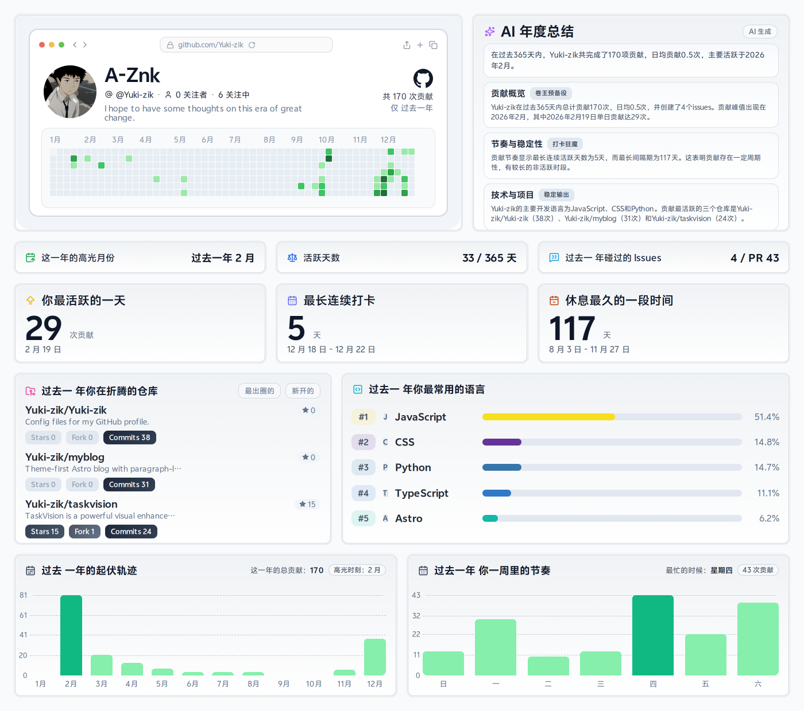

# Yuki-zik

  

## About Me

- 专注自动化、前后端工程化和实用工具开发。
- 持续把零散需求整理成可复用、可维护的项目。
- 喜欢高频迭代，但坚持稳定交付。

## Auto Update

- 生成命令: `node scripts/year-report/generate-report.mjs`
- 调度方式: 每周自动执行 `.github/workflows/yearly-report.yml`
- 数据来源: GitHub GraphQL API（配置私有权限后可包含私有贡献）
- AI 总结: OpenAI 兼容接口，失败自动降级为规则文案

## Links

- GitHub: https://github.com/Yuki-zik
- Telegram: https://t.me/A_Znkv

## Live Stats

  
  

