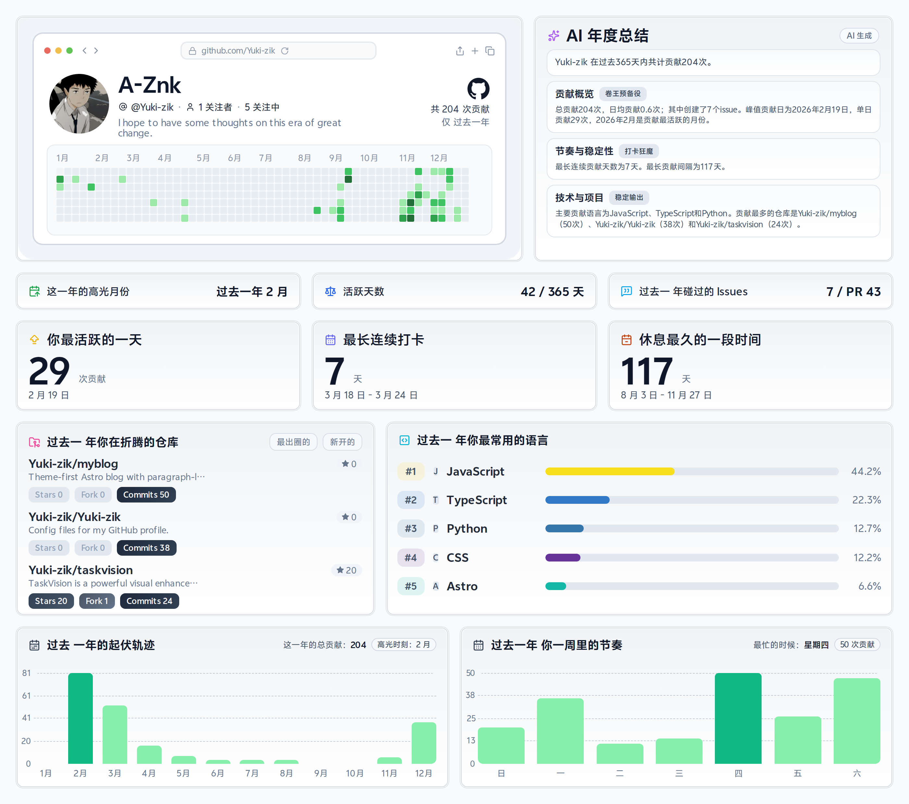

  
  
  

    
    
  

---

 

### 🛠 Tech Stack

---

### 📊 GitHub Stats

  
  

 

  

---

### 🚀 Featured Project: Self-Generating Profile

> This profile works hard so I don't have to. It automatically generates a yearly report and updates itself using GitHub Actions.

  

<b>⚙️ How it works (Under the hood)</b>

- **Yearly report generator**: `node scripts/year-report/generate-report.mjs`
- **Schedule**: Runs weekly via `.github/workflows/yearly-report.yml`
- **Data Source**: Fetches data from GitHub GraphQL API
- **AI Summary**: Generates insights using OpenAI-compatible endpoint

---

### 🐍 Contribution Snake

  

---

  Design inspired by <a href="https://github.com/Codennnn/Green-Wall">Green-Wall</a>

