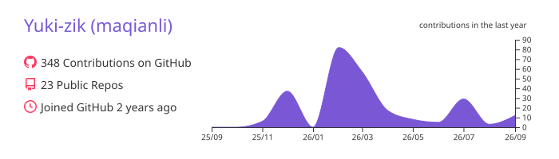
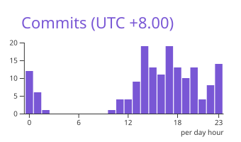
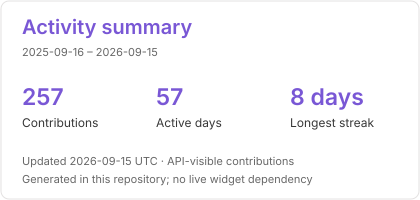
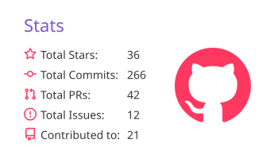
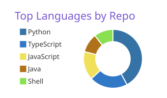
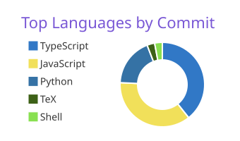
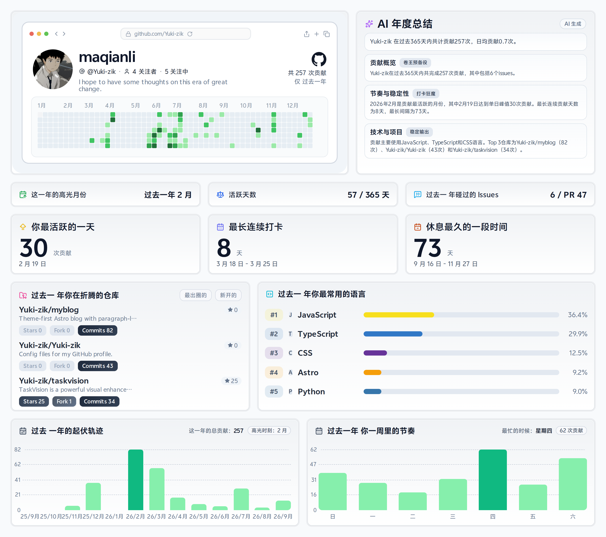

  
  

    
    
    
  

<table align="center">
  <tr><td align="center" colspan="6"></td></tr>
  <tr>
    <td align="center" colspan="3"></td>
    <td align="center" colspan="3"></td>
  </tr>
  <tr>
    <td align="center" colspan="2"></td>
    <td align="center" colspan="2"></td>
    <td align="center" colspan="2"></td>
  </tr>
</table>

---

### GitHub Activity Report

A rolling 365-day report, refreshed weekly. Click the image to open the full-size report.

  

<!-- REPORT_STATUS:START -->
Last successful refresh in the existing snapshot: **2026-09-14 07:54:55 UTC**. The repaired workflow will write its next successful refresh here.
<!-- REPORT_STATUS:END -->

[Report workflow](https://github.com/Yuki-zik/Yuki-zik/actions/workflows/yearly-report.yml) · [Data snapshot](./assets/github-annual-report.json) · [Automation configuration](./PROFILE_AUTOMATION.md)

<b>Data scope and refresh behavior</b>

- The report defaults to the last 365 days in `Asia/Shanghai`. Manual runs can select a calendar year; the current year is year-to-date.
- Contributions are those visible through the configured GitHub token, not every commit across all accounts and private repositories.
- Repository details and language breakdowns are restricted to public repositories. Language proportions describe repository code bytes, not personal lines written.
- After the repair, Issue/PR counts represent public items **authored by me and created during the report period**. The older snapshot used a broader participation/updated-date query.
- Summary cards refresh daily and have their own scopes; their lifetime totals need not equal the rolling report.
- AI analysis is optional. Without its API configuration, a deterministic summary is used. Rendering failures keep the previous report and fail the workflow rather than publishing a blank image.

---

### Contribution Snake

  <picture>
    <source media="(prefers-color-scheme: dark)" srcset="https://raw.githubusercontent.com/Yuki-zik/Yuki-zik/output/github-contribution-grid-snake-dark.svg" />
    
  </picture>

Design inspired by <a href="https://github.com/Codennnn/Green-Wall">Green-Wall</a>

